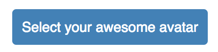

# react-firebase-file-uploader

A file uploader for react that uploads images, videos and other files to your firebase storage.

## Props

- `storageRef` (required) - A reference to the firebase storage folder, where the file should be saved.
- `onUploadStart` - A callback function that is called with the selected file as its first argument and the upload task as its second argument.
- `onProgress` - A callback function that is called with the progress (between 0 and 100) as its first argument and the upload task as its second argument.
- `onUploadSuccess` - A callback function that is called with the filename of the uploaded file as its first argument and the upload task as its second argument.
- `onUploadError` - A callback function that is called with a [Firebase error](https://firebase.google.com/docs/storage/web/handle-errors) in case of an error during the upload process.
- `filename` - The name you would like to give to the file. This can either be a function or a string. If a function is provided, it will be called with the selected file as its first and only argument. If no value is provided, it will use the filename of the file itself or a random generated name if `randomizeFilename` is set to true.
- `metadata` - An object with the metadata that should be added to the file. You can use this for example to configure caching for your file with `metadata={{cacheControl: 'max-age=3600'}}`.
- `randomizeFilename` - If true, generates a random filename for your file.
- `hidden` - If true the rendered html input element will be hidden. This is useful if you want to [render a custom button](#rendering-a-custom-button).
- `as` - The component you provide in this prop will be rendered instead of the standard html `input`.
- `maxHeight` - The maximum height of in case an image is provided, please see below for more explanation.
- `maxWidth` - The maximum width in case a image is provided.
  The image will be scaled down, such that the image is contained in the maxWidth/maxHeight region.
  The resulting image will be centered and the parts that stick out will be cropped off.
- Default props of a html `input` such as `accept`, `disabled`, `form`, `formNoValidate`, `name`, `readOnly`, `required`, `value`, `multiple`.

## Prerequisites

Make sure you have initialized firebase somewhere in your app using:

```jsx
import firebase from "firebase";

const config = {
  apiKey: "<API_KEY>",
  authDomain: "<PROJECT_ID>.firebaseapp.com",
  databaseURL: "https://<DATABASE_NAME>.firebaseio.com",
  storageBucket: "<BUCKET>.appspot.com"
};
firebase.initializeApp(config);
```

## Example

```jsx
import React, { Component } from "react";
import firebase from "firebase";
import FileUploader from "react-firebase-file-uploader";

class ProfilePage extends Component {
  state = {
    username: "",
    avatar: "",
    isUploading: false,
    progress: 0,
    avatarURL: ""
  };

  handleChangeUsername = event =>
    this.setState({ username: event.target.value });
  handleUploadStart = () => this.setState({ isUploading: true, progress: 0 });
  handleProgress = progress => this.setState({ progress });
  handleUploadError = error => {
    this.setState({ isUploading: false });
    console.error(error);
  };
  handleUploadSuccess = filename => {
    this.setState({ avatar: filename, progress: 100, isUploading: false });
    firebase
      .storage()
      .ref("images")
      .child(filename)
      .getDownloadURL()
      .then(url => this.setState({ avatarURL: url }));
  };

  render() {
    return (
      <div>
        <form>
          <label>Username:</label>
          <input
            type="text"
            value={this.state.username}
            name="username"
            onChange={this.handleChangeUsername}
          />
          <label>Avatar:</label>
          {this.state.isUploading && <p>Progress: {this.state.progress}</p>}
          {this.state.avatarURL && }
          <FileUploader
            accept="image/*"
            name="avatar"
            randomizeFilename
            storageRef={firebase.storage().ref("images")}
            onUploadStart={this.handleUploadStart}
            onUploadError={this.handleUploadError}
            onUploadSuccess={this.handleUploadSuccess}
            onProgress={this.handleProgress}
          />
        </form>
      </div>
    );
  }
}

export default ProfilePage;
```

### Rendering a custom button

Most of the times the default html input element doesn't look very nice. There are two ways in which you can render a custom button:

#### Wrapping the input in a label

You can render a custom button by wrapping the upload component in a `label` as follows:

```jsx
...
  <label style={{backgroundColor: 'steelblue', color: 'white', padding: 10, borderRadius: 4, cursor: 'pointer'}}>
    Select your awesome avatar
    <FileUploader
      hidden
      accept="image/*"
      storageRef={firebase.storage().ref('images')}
      onUploadStart={this.handleUploadStart}
      onUploadError={this.handleUploadError}
      onUploadSuccess={this.handleUploadSuccess}
      onProgress={this.handleProgress}
    />
  </label>
...
```

Please note that you will need to provide the `hidden` prop to hide the default html input element.

The above code will render this:



#### Using the `CustomUploadButton` component

There is a littel helper component that you can find in `'react-firebase-file-uploader/lib/CustomUploadButton'`. This component will wrap the input in a label for you and automatically adds the `pointer` type for the cursor and the `htmlFor` prop based on the id that you provide. The label can be styled using the `style` or `className` prop like this:

```jsx
...
import CustomUploadButton from 'react-firebase-file-uploader/lib/CustomUploadButton';
...
  <CustomUploadButton
    accept="image/*"
    storageRef={firebase.storage().ref('images')}
    onUploadStart={this.handleUploadStart}
    onUploadError={this.handleUploadError}
    onUploadSuccess={this.handleUploadSuccess}
    onProgress={this.handleProgress}
    style={{backgroundColor: 'steelblue', color: 'white', padding: 10, borderRadius: 4}}
  >
    Select your awesome avatar
  </CustomUploadButton>
...
```

This will result in the same rendered button as the [wrap example](#wrapping-the-input-in-a-label).

### Generate a filename

If you would like to generate a filename yourself you can provide a function as `filename` attribute:

```jsx
...
  <FileUploader
    accept="image/*"
    name="avatar"
    filename={file => this.state.username + file.name.split('.')[1]; }
    storageRef={firebase.storage().ref('images')}
    onUploadStart={this.handleUploadStart}
    onUploadError={this.handleUploadError}
    onUploadSuccess={this.handleUploadSuccess}
    onProgress={this.handleProgress}
  />
...
```

In the example above, the filename is generated by is naively (do not use in production!) extracting the file extension from the selected file and placing it after the username, such that the resulting filename will be `johndoe.jpg` if the username were `johndoe` and the extension of the selected file `.jpg`.

### Uploading multiple files

If you provide the `multiple` prop to the input, this will allow a user to select and upload multiple files at once. All callbacks will be called with the upload task as second argument. You can use this task to discriminate between the uploaded files, for example by using the path in `task.snapshot.ref.fullPath` as identifier for the upload.

Try it on CodeSandbox

[](https://codesandbox.io/s/30k0kx6k7m)

Or just copy/paste from here:
```jsx
import React from "react";
import ReactDOM from "react-dom";
import firebase from "firebase";
import FileUploader from "react-firebase-file-uploader";

// Setup Firebase
firebase.initializeApp({
  apiKey: "API_KEY",
  storageBucket: "PROJECT_ID.appspot.com"
});

class App extends React.Component {
  state = {
    filenames: [],
    downloadURLs: [],
    isUploading: false,
    uploadProgress: 0
  };

  handleUploadStart = () =>
    this.setState({
      isUploading: true,
      uploadProgress: 0
    });

  handleProgress = progress =>
    this.setState({
      uploadProgress: progress
    });

  handleUploadError = error => {
    this.setState({
      isUploading: false
      // Todo: handle error
    });
    console.error(error);
  };

  handleUploadSuccess = async filename => {
    const downloadURL = await firebase
      .storage()
      .ref("images")
      .child(filename)
      .getDownloadURL();

    this.setState(oldState => ({
      filenames: [...oldState.filenames, filename],
      downloadURLs: [...oldState.downloadURLs, downloadURL],
      uploadProgress: 100,
      isUploading: false
    }));
  };

  render() {
    return (
      <div>
        <FileUploader
          accept="image/*"
          name="image-uploader-multiple"
          randomizeFilename
          storageRef={firebase.storage().ref("images")}
          onUploadStart={this.handleUploadStart}
          onUploadError={this.handleUploadError}
          onUploadSuccess={this.handleUploadSuccess}
          onProgress={this.handleProgress}
          multiple
        />

        <p>Progress: {this.state.uploadProgress}</p>

        <p>Filenames: {this.state.filenames.join(", ")}</p>

        <div>
          {this.state.downloadURLs.map((downloadURL, i) => {
            return ;
          })}
        </div>
      </div>
    );
  }
}

const rootElement = document.getElementById("root");
ReactDOM.render(<App />, rootElement);
```

### Starting downloads manually

If you prefer triggering downloads manually (i.e. on a click of a button), rather than automatically when file(s) are selected, you can do so by overriding the default `onChange`event handler.

To do so, you have to save a `reference` to the component.

```jsx
class MyAwesomeComponent extends React.Component {
  state = {
    files: [],
  };

  /**
  * Custom onChange event handler
  * Store selected files in the state
  */
  customOnChangeHandler = (event) => {
    const { target: { files } } = event;
    const filesToStore = [];

    files.forEach(file => filesToStore.push(file));

    this.setState({ files: filesToStore });
  }

  /**
  * Start download handler using the file uploader reference
  */
  startUploadManually = () => {
    const { files } = this.state;
    files.forEach(file => {
      this.fileUploader.startUpload(file)
    });
  }

  render() {
  ...
    <FileUploader
        ...
        onChange={this.customOnChangeHandler} // ⇐ Call your handler
        ref={instance => { this.fileUploader = instance; } }  // ⇐ reference the component
    />
    <button onClick={this.startUploadManually}>Upload all the things</button>
    ...
  }
}
```
